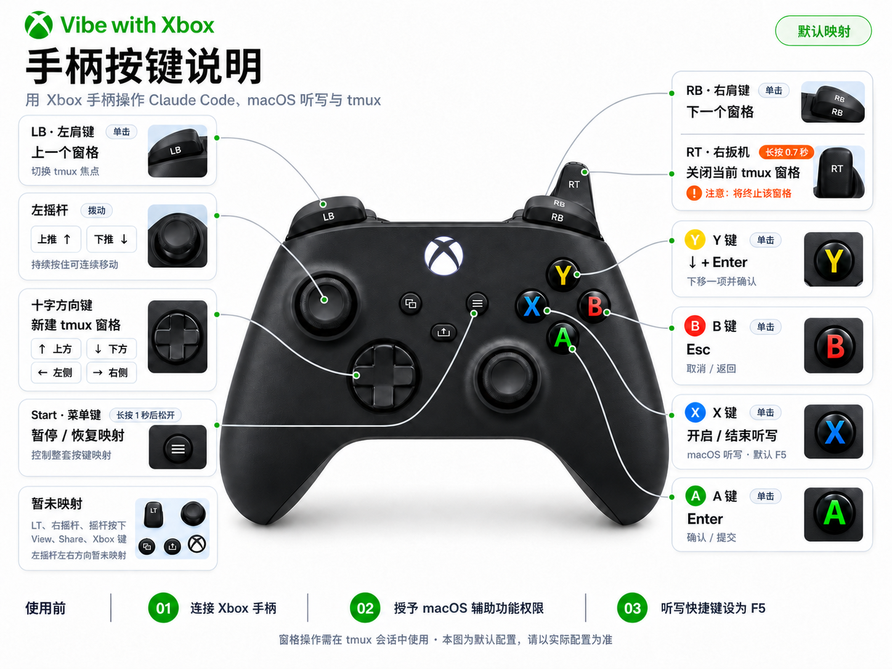

# Vibe with Xbox

**简体中文** | [English](README_EN.md)

把 Xbox 手柄变成 macOS 上的轻量遥控器，用来操作 **Claude Code**、**macOS 听写**和 **tmux**。

Vibe with Xbox 会在本机浏览器中打开按键说明与运行状态页面。连接手柄并启动 Bridge 后，可以用手柄确认或取消 Claude Code 提示、上下选择选项、切换听写，以及管理 tmux 窗格。

> 当前版本：`0.2.0`。目前仅支持 macOS。

## 按键说明



上图展示默认映射。使用自定义配置后，请以程序页面中的 **Current Mapping** 为准。

## 功能

- 在浏览器中显示手柄示意图、当前映射、连接状态和最近一次操作。
- 按下实体按键时，页面会实时高亮对应控制项。
- 向当前获得焦点的 macOS 应用发送 `Enter`、`Esc`、方向键和听写快捷键。
- 使用十字键、LB、RB 和 RT 管理 tmux 窗格。
- 长按 Start 1 秒后松开，可暂停或恢复整套映射。
- 提供环境检查、原始手柄事件调试、自定义 JSON 配置和无界面运行模式。
- 本地页面仅监听 `127.0.0.1`；项目代码不会把按键事件发送到云端。

## 默认映射

| 手柄输入 | 默认操作 | 说明 |
| --- | --- | --- |
| A | `Enter` | 确认当前选项或提交输入 |
| B | `Esc` | 取消、关闭选择器或返回 |
| X | macOS 听写 | 使用已配置的听写快捷键，默认 `F5` |
| Y | `↓` + `Enter` | 下移一项并确认，适合 yes / auto-edit 类提示 |
| 左摇杆上 / 下 | `↑` / `↓` | 持续拨动时自动重复 |
| 十字键上 / 下 | 新建上方 / 下方窗格 | 需要 tmux 会话 |
| 十字键左 / 右 | 新建左侧 / 右侧窗格 | 需要 tmux 会话 |
| LB / RB | 上一个 / 下一个窗格 | 需要 tmux 会话 |
| 长按 RT 0.7 秒 | 关闭当前窗格 | 会终止该 tmux 窗格，请谨慎使用 |
| 长按 Start 1 秒后松开 | 暂停 / 恢复映射 | 暂停后手柄输入不会触发动作 |

LT、右摇杆、摇杆按下、View、Share、Xbox 键，以及左摇杆的左右方向暂未映射。

## 环境要求

- macOS 12 或更高版本。
- Python 3.10 或更高版本。
- 可通过蓝牙连接到 Mac 的 Xbox 手柄。
- [tmux](https://github.com/tmux/tmux)，仅在使用窗格相关功能时需要。
- macOS 辅助功能权限，用于向其他应用发送按键。

## 快速开始

### 1. 安装

克隆或下载仓库后，在项目目录执行：

```bash
python3 -m venv .venv
source .venv/bin/activate
python -m pip install -r requirements.txt
```

如需使用 tmux 窗格操作，请先安装 tmux。例如使用 Homebrew：

```bash
brew install tmux
```

### 2. 完成 macOS 设置

1. 打开 **系统设置 → 蓝牙**，连接 Xbox 手柄。
2. 打开 **系统设置 → 隐私与安全性 → 辅助功能**，为运行本项目的 Terminal、Python，或打包后的 `Vibe with Xbox.app` 授权。
3. 打开 **系统设置 → 键盘 → 听写**，启用听写，并把听写快捷键设为 `F5`。
4. 如需窗格操作，先启动一个 tmux 会话：

   ```bash
   tmux new -s vibe
   ```

可以先运行环境检查：

```bash
python xbox_vibe.py --doctor
```

`Dictation` 显示 `WARN` 是正常的：macOS 不提供可靠的 API 来读取该快捷键，程序只能提醒你手动确认它是否为 `F5`。

### 3. 启动

```bash
python xbox_vibe.py
```

程序会在默认浏览器中打开本地页面，通常为 `http://127.0.0.1:8765/`。如果端口被占用，会自动尝试其他本地端口。

在页面中：

1. 点击 **Run Checks**，确认手柄和辅助功能权限可用。
2. 点击 **Start Bridge**，等待 Controller 状态显示已连接。
3. 切换到 Claude Code、终端或其他目标应用，并让目标窗口保持焦点。
4. 使用手柄执行操作；浏览器页面会显示实时高亮和最近一次动作。
5. 完成后点击 **Stop** 停止映射，或点击 **Quit App** 退出程序。

> Bridge 发送的是系统级按键，动作会作用于当前获得焦点的应用。开始操作前，请先确认焦点位于正确窗口。

## 其他运行方式

### 无界面模式

直接在终端运行 Bridge，不打开浏览器说明页：

```bash
python xbox_vibe.py --headless
```

按 `Ctrl+C` 停止。

### 调试手柄索引

只打印原始按钮和轴事件，不执行映射动作：

```bash
python xbox_vibe.py --debug
```

如果你的手柄按键没有触发预期操作，请用此模式确认 macOS / pygame 上报的按钮索引。

### 查看命令帮助

```bash
python xbox_vibe.py --help
```

| 参数 | 作用 |
| --- | --- |
| `--doctor` | 检查手柄、辅助功能、tmux 和听写设置 |
| `--headless` | 不启动浏览器页面，直接运行 Bridge |
| `--debug` | 打印原始手柄事件，不发送按键或执行 tmux 命令 |
| `--init-config` | 创建默认用户配置文件 |
| `--print-config-path` | 输出当前配置文件路径 |
| `--show-mapping` | 输出合并配置后的当前映射 |
| `--config PATH` | 使用指定的 JSON 配置文件 |

## 自定义映射

创建用户配置文件：

```bash
python xbox_vibe.py --init-config
python xbox_vibe.py --print-config-path
```

默认路径为：

```text
~/.config/vibe-with-xbox/config.json
```

也可以复制 [`config.example.json`](config.example.json)，然后通过参数加载：

```bash
python xbox_vibe.py --config ./my-config.json
```

配置会与内置默认值递归合并，因此只需要填写想覆盖的字段。修改完成后请退出并重新启动程序；当前版本不会在运行时自动重载配置。

查看配置合并后的实际映射：

```bash
python xbox_vibe.py --show-mapping
```

常用参数位于 `general`：

| 字段 | 默认值 | 作用 |
| --- | --- | --- |
| `deadzone` | `0.5` | 左摇杆触发方向键的死区 |
| `trigger_threshold` | `0.2` | RT 被视为按下的阈值 |
| `repeat_initial_delay` | `0.35` | 左摇杆首次连发前的等待时间，单位为秒 |
| `repeat_rate` | `0.08` | 左摇杆持续拨动时的连发间隔，单位为秒 |
| `start_hold_seconds` | `1.0` | Start 切换暂停状态所需的长按时间，单位为秒 |

## 构建 macOS App

构建脚本会创建独立的 `.venv-build` 环境、安装开发依赖并运行 PyInstaller：

```bash
./scripts/build_macos_app.sh
```

输出位置：

```text
dist/Vibe with Xbox.app
```

把应用拖到 `/Applications` 后启动，并为它授予辅助功能权限。当前脚本生成的是本地未签名构建；如果要向其他用户分发 `.app`，还需要自行完成 Developer ID 签名和 Apple 公证。

## 常见问题

### 检测不到手柄

- 确认手柄已经在 macOS 蓝牙设置中连接，而不是只完成配对。
- 退出并重新启动程序，再运行 `python xbox_vibe.py --doctor`。
- 运行 `python xbox_vibe.py --debug`，确认 pygame 能收到按钮和摇杆事件。
- 当前版本使用系统识别到的第一个手柄；同时连接多个手柄时，请先断开其他设备。

### 按键没有作用

- 确认已经点击 **Start Bridge**，并且映射未被 Start 暂停。
- 在 **系统设置 → 隐私与安全性 → 辅助功能** 中确认权限已经开启。
- 授权后完全退出并重新启动 Terminal、Python 或 `Vibe with Xbox.app`。
- 确认目标应用处于前台并获得键盘焦点。

### X 键不能切换听写

- 确认 macOS 听写已启用。
- 确认听写快捷键设置为 `F5`，或在配置文件中同步修改 `macos.dictation_key`。
- 某些 Mac 键盘需要关闭“将 F1、F2 等键用作标准功能键”相关冲突。

### tmux 按键没有作用

- 确认 `tmux` 位于 `PATH` 中：`command -v tmux`。
- 确认至少有一个会话正在运行：`tmux list-sessions`。
- 可执行 `tmux new -s vibe` 新建会话后重试。
- RT 会关闭当前窗格；为避免误触，它必须持续按住 0.7 秒。

## 项目结构

```text
vibe_with_xbox/
├── bridge.py        # pygame 手柄事件循环与动作分发
├── cli.py           # 命令行入口
├── config.py        # 默认映射与配置合并
├── doctor.py        # 环境检查
├── macos.py         # macOS 按键发送与辅助功能检查
├── tmux_control.py  # tmux 命令封装
└── ui.py            # 本地 HTTP 页面与实时事件
```

## 参与贡献

欢迎提交 Issue 和 Pull Request。提交前建议至少运行：

```bash
python -m compileall vibe_with_xbox xbox_vibe.py
python xbox_vibe.py --help
python xbox_vibe.py --show-mapping
```

涉及实体手柄映射的修改，请同时使用 `--debug` 在 macOS 上验证，并更新 README 中的映射表和按键说明图。

## 许可证

本项目采用 [MIT License](LICENSE)。
