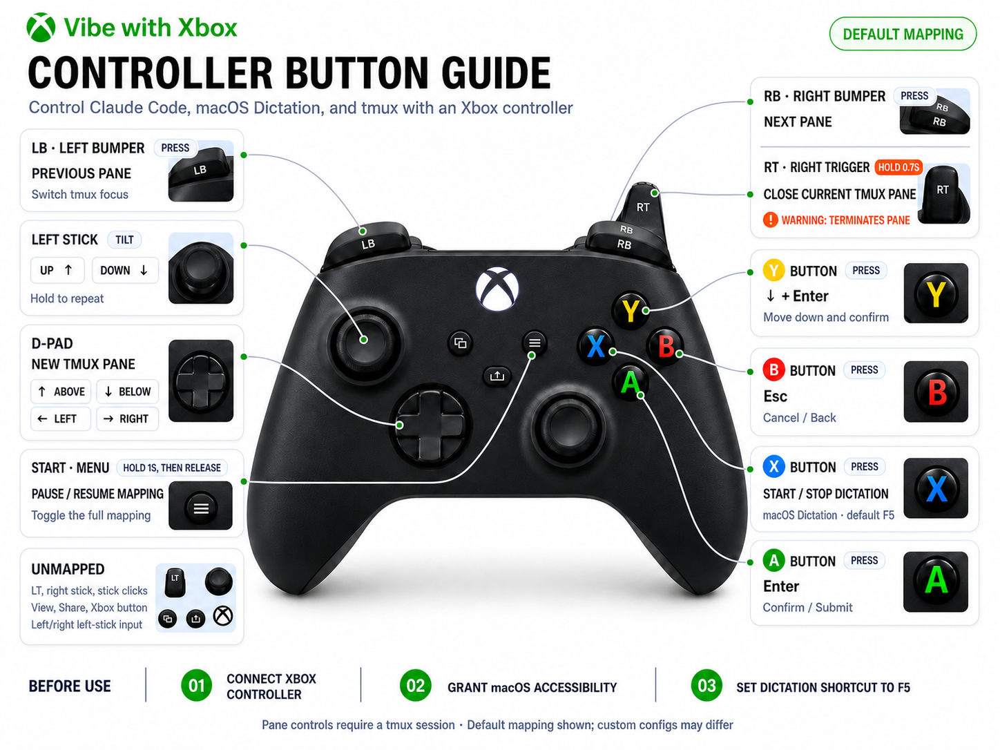

# Vibe with Xbox

[简体中文](README.md) | **English**

Turn an Xbox controller into a lightweight macOS remote for **Claude Code**, **macOS Dictation**, and **tmux**.

Vibe with Xbox opens a local controller guide and status page in your browser. Once the controller is connected and the bridge is running, you can confirm or cancel Claude Code prompts, move through choices, toggle Dictation, and manage tmux panes from the controller.

> Current version: `0.2.0`. macOS only.

## Controller Guide



The image shows the default mapping. If you use a custom configuration, refer to **Current Mapping** in the local guide for the effective controls.

## Features

- Shows the controller, active mapping, connection status, and latest action in a browser.
- Highlights controls in real time when physical buttons are pressed.
- Sends `Enter`, `Esc`, arrow keys, and the Dictation shortcut to the focused macOS app.
- Manages tmux panes with the D-pad, LB, RB, and RT.
- Pauses or resumes the complete mapping when Start is held for one second and released.
- Includes setup checks, raw controller event debugging, custom JSON configuration, and a headless mode.
- The local guide listens only on `127.0.0.1`; the project does not send controller events to the cloud.

## Default Mapping

| Controller input | Default action | Notes |
| --- | --- | --- |
| A | `Enter` | Confirm the current choice or submit input |
| B | `Esc` | Cancel, close a picker, or go back |
| X | macOS Dictation | Uses the configured Dictation shortcut; defaults to `F5` |
| Y | `↓` + `Enter` | Move down once and confirm; useful for yes / auto-edit prompts |
| Left stick up / down | `↑` / `↓` | Repeats while the stick remains tilted |
| D-pad up / down | Create a pane above / below | Requires a running tmux session |
| D-pad left / right | Create a pane on the left / right | Requires a running tmux session |
| LB / RB | Previous / next pane | Requires a running tmux session |
| Hold RT for 0.7 seconds | Close the current pane | Terminates that tmux pane; use with care |
| Hold Start for 1 second, then release | Pause / resume mapping | Controller input does not trigger actions while paused |

LT, the right stick, stick clicks, View, Share, the Xbox button, and horizontal left-stick movement are currently unmapped.

## Requirements

- macOS 12 or later.
- Python 3.10 or later.
- An Xbox controller connected to the Mac over Bluetooth.
- [tmux](https://github.com/tmux/tmux), only for pane-management actions.
- macOS Accessibility permission so the app can send keys to other applications.

## Quick Start

### 1. Install

After cloning or downloading the repository, run the following commands from the project directory:

```bash
python3 -m venv .venv
source .venv/bin/activate
python -m pip install -r requirements.txt
```

Install tmux if you want to use pane controls. With Homebrew:

```bash
brew install tmux
```

### 2. Configure macOS

1. Open **System Settings → Bluetooth** and connect the Xbox controller.
2. Open **System Settings → Privacy & Security → Accessibility** and grant access to the Terminal or Python runtime used to run the project, or to the packaged `Vibe with Xbox.app`.
3. Open **System Settings → Keyboard → Dictation**, enable Dictation, and set its shortcut to `F5`.
4. Start a tmux session if you want to use pane controls:

   ```bash
   tmux new -s vibe
   ```

Run the setup checks:

```bash
python xbox_vibe.py --doctor
```

A `WARN` result for `Dictation` is expected. macOS does not provide a reliable API for reading this shortcut, so the app can only remind you to verify that it is set to `F5`.

### 3. Run

```bash
python xbox_vibe.py
```

The app opens the local guide in your default browser, normally at `http://127.0.0.1:8765/`. If that port is unavailable, it automatically tries another local port.

In the guide:

1. Click **Run Checks** and confirm that the controller and Accessibility permission are available.
2. Click **Start Bridge** and wait for the Controller status to show that it is connected.
3. Switch to Claude Code, a terminal, or another target application and keep that window focused.
4. Use the controller. The guide displays live highlights and the most recent action.
5. Click **Stop** to stop the mapping, or **Quit App** to exit.

> The bridge sends system-level keystrokes to whichever application currently has focus. Check the focused window before using the controller.

## Other Run Modes

### Headless Mode

Run the bridge directly in a terminal without opening the browser guide:

```bash
python xbox_vibe.py --headless
```

Press `Ctrl+C` to stop it.

### Debug Controller Indices

Print raw button and axis events without performing mapped actions:

```bash
python xbox_vibe.py --debug
```

If a controller button triggers the wrong action, use this mode to inspect the indices reported by macOS and pygame.

### Command Help

```bash
python xbox_vibe.py --help
```

| Option | Purpose |
| --- | --- |
| `--doctor` | Check the controller, Accessibility permission, tmux, and Dictation setup |
| `--headless` | Run the bridge without the browser guide |
| `--debug` | Print raw controller events without sending keys or running tmux commands |
| `--init-config` | Create the default user configuration file |
| `--print-config-path` | Print the active configuration path |
| `--show-mapping` | Print the effective merged mapping |
| `--config PATH` | Load a specified JSON configuration file |

## Custom Mapping

Create a user configuration file:

```bash
python xbox_vibe.py --init-config
python xbox_vibe.py --print-config-path
```

The default location is:

```text
~/.config/vibe-with-xbox/config.json
```

You can also copy [`config.example.json`](config.example.json) and load it explicitly:

```bash
python xbox_vibe.py --config ./my-config.json
```

The file is recursively merged with the built-in defaults, so it only needs to contain fields you want to override. Exit and restart the app after making changes; the current version does not reload the configuration while running.

Print the effective mapping after merging:

```bash
python xbox_vibe.py --show-mapping
```

Common options under `general`:

| Field | Default | Purpose |
| --- | --- | --- |
| `deadzone` | `0.5` | Left-stick dead zone for arrow-key actions |
| `trigger_threshold` | `0.2` | Threshold at which RT is considered pressed |
| `repeat_initial_delay` | `0.35` | Delay before left-stick key repeat begins, in seconds |
| `repeat_rate` | `0.08` | Repeat interval while the left stick remains tilted, in seconds |
| `start_hold_seconds` | `1.0` | Required Start hold time before mapping is toggled, in seconds |

## Build the macOS App

The build script creates an isolated `.venv-build` environment, installs the development dependencies, and runs PyInstaller:

```bash
./scripts/build_macos_app.sh
```

Output:

```text
dist/Vibe with Xbox.app
```

Move the app to `/Applications`, launch it, and grant it Accessibility permission. The script produces an unsigned local build. Distributing the `.app` to other users also requires Developer ID signing and Apple notarization.

## Troubleshooting

### Controller Not Detected

- Confirm that the controller is connected, not merely paired, in macOS Bluetooth settings.
- Exit and restart the app, then run `python xbox_vibe.py --doctor`.
- Run `python xbox_vibe.py --debug` and verify that pygame receives button and stick events.
- The current version uses the first controller reported by the system. Disconnect other controllers when troubleshooting.

### Buttons Do Not Trigger Actions

- Confirm that you clicked **Start Bridge** and that the mapping has not been paused with Start.
- Confirm that Accessibility permission is enabled under **System Settings → Privacy & Security → Accessibility**.
- Completely quit and relaunch Terminal, Python, or `Vibe with Xbox.app` after granting permission.
- Make sure the target application is in the foreground and has keyboard focus.

### X Does Not Toggle Dictation

- Confirm that macOS Dictation is enabled.
- Set the Dictation shortcut to `F5`, or update `macos.dictation_key` in the configuration to match.
- Check for conflicts with the keyboard setting that changes whether F1, F2, and similar keys act as standard function keys.

### tmux Controls Do Not Work

- Confirm that tmux is on `PATH`: `command -v tmux`.
- Confirm that at least one session is running: `tmux list-sessions`.
- Run `tmux new -s vibe` to create a session, then try again.
- RT closes the current pane and must remain held for 0.7 seconds to reduce accidental activation.

## Project Structure

```text
vibe_with_xbox/
├── bridge.py        # pygame event loop and action dispatch
├── cli.py           # command-line entry point
├── config.py        # default mapping and configuration merge
├── doctor.py        # setup checks
├── macos.py         # macOS key events and Accessibility checks
├── tmux_control.py  # tmux command wrapper
└── ui.py            # local HTTP guide and real-time events
```

## Contributing

Issues and pull requests are welcome. Before submitting a change, run at least:

```bash
python -m compileall vibe_with_xbox xbox_vibe.py
python xbox_vibe.py --help
python xbox_vibe.py --show-mapping
```

For changes to physical controller mappings, also verify the indices with `--debug` on macOS and update both mapping tables and controller-guide images.

## License

This project is licensed under the [MIT License](LICENSE).
